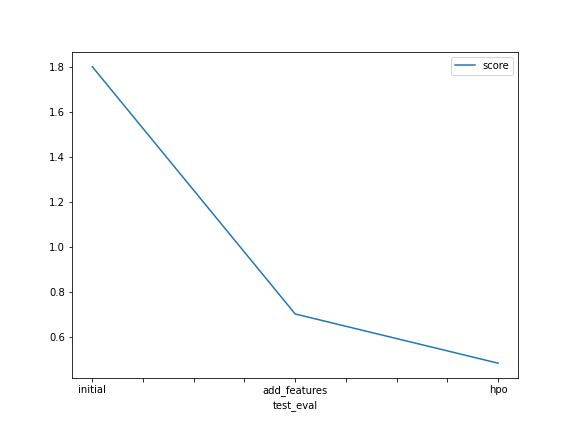

# Report: Predict Bike Sharing Demand with AutoGluon Solution

#### Irvi Aini

## Initial Training

### What did you realize when you tried to submit your predictions? What changes were needed to the output of the predictor to submit your results?

The first model didn't perform that well. There's also a need of replacing the negative values for the predictions to 0.

### What was the top ranked model that performed?

The WeightedEnsemble_L3 model with hiper tuning optimization.

## Exploratory data analysis and feature creation

### What did the exploratory analysis find and how did you add additional features?

During the exploration it's better to split the time and date information to year, month, and date.
It's also better to convert the intended categorical features like seasons and weather.

### How much better did your model preform after adding additional features and why do you think that is?

Splitting the date and time will be useful for season and weather categorization in regression models.

## Hyper parameter tuning

### How much better did your model preform after trying different hyper parameters?

When using a hyper parameter tuning we should really be aware of the possibility of having over fitted models.

### If you were given more time with this dataset, where do you think you would spend more time?

Do a more elaborate exploratory data analysis.

### Create a table with the models you ran, the hyperparameters modified, and the kaggle score.

|model|hpo1|hpo2|hpo3|score|
|--|--|--|--|--|
|initial|default_vals|default_vals|default_vals|1.76379|
|add_features|default_vals|default_vals|default_vals|0.70591|
|hpo|num_leaves: lower=26, upper=66|dropout_prob: 0.0, 0.5|num_boost_round: 100|0.47927|

### Create a line plot showing the top model score for the three (or more) training runs during the project.

### Create a line plot showing the top kaggle score for the three (or more) prediction submissions during the project.

## Summary

In this project, we have obtained/explored following steps in the ML Lifecycle.

- Problem: Better utilization of the data generated by the systems in the bike sharing industry.
- Business Objective: Predict bike sharing demand provided data related to different factors provided. 
- Getting the Data and Performing Exploratory Data Analysis.
  - Data is obtained from the "Bike Sharing Demand" kaggle competition. 
  - Doing Exploratory Data Analysis 
- Build Model Built models using Autogluon AutomML library.
- Test model's performance by submitting it into kaggle.
